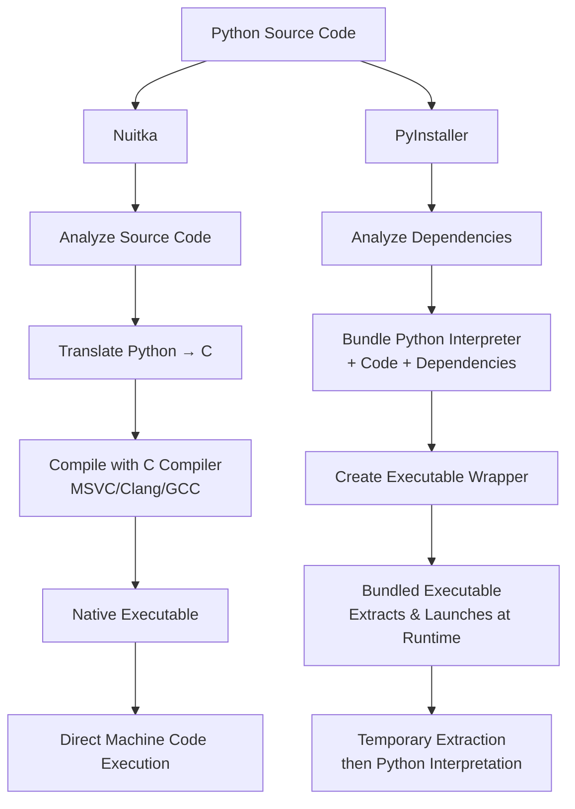

### To Begin with....

Python was designed as an **interpreted language** with these assumptions:

- **Source code visibility**: Python files (.py) are meant to be readable text
- **Runtime flexibility**: Dynamic imports, monkey patching, and runtime code modification
- **Distribution model**: Sharing source code or installing via package managers (pip)
- **Development workflow**: Interactive development with immediate feedback

<Info>
**Historical Context**: When Python was created in 1991, the concept of "packaging an interpreter with your code" wasn't a primary consideration. The focus was on simplicity and readability, not standalone distribution.
</Info>

But users wanted a way to redistribute their code without requiring end users to install Python or manage dependencies. This need drove the creation of tools like PyInstaller and Nuitka, each taking fundamentally different approaches to solve the same problem.

## How They Work

### Freezing vs Compilation

PyInstaller is not a compiler, but a *freezer*. It essentially grabs the Python interpreter, all dependencies, and packages them together (think .zip), then creates an executable file that extracts and runs this bundle at runtime.

Nuitka will actually *transpile* (convert as much Python code as possible from Python into C[1](#footnote-1)), then *compile* the code using a C compiler like MSVC, Clang or GCC to produce native machine code.

<AccordionGroup>
  <Accordion title="Why Antivirus Software Gets Suspicious" icon="shield-exclamation">
    Both Nuitka and PyInstaller face a common challenge that stems from Python's fundamental design philosophy: **Python was never intended to be packaged into standalone executables**.

    <Callout type="warning">
    **The Core Issue**: Antivirus software flags both tools because they exhibit behaviors traditionally associated with malware - self-extracting archives, dynamic code loading, and runtime modifications.
    </Callout>

    When you package Python applications into executables, several factors trigger antivirus heuristics:

    <Steps>
      <Step title="Self-Extracting Behavior">
        Both tools create executables that unpack Python interpreters and libraries at runtime, similar to how some malware operates
      </Step>
      
      <Step title="Dynamic Import Patterns">
        Python's `import` system loads code dynamically, which antivirus software interprets as potentially malicious code injection
      </Step>
      
      <Step title="Bytecode Execution">
        Running Python bytecode from memory (especially with PyInstaller) resembles fileless malware techniques
      </Step>
      
      <Step title="Uncommon Executable Patterns">
        The resulting executables have unusual internal structures that don't match typical compiled binaries
      </Step>
    </Steps>
  </Accordion>

  <Accordion title="The False Positive Reality" icon="triangle-exclamation">
    <Warning>
    **The Fundamental Challenge**: Python's dynamic, interpreted nature conflicts with the static, predictable patterns that antivirus software expects from legitimate executables. This is the core reason why both tools face detection issues - it's not a bug, it's a fundamental architectural mismatch.
    </Warning>

    <Warning>
    **Common Experience**: Antivirus engines frequently flag freshly compiled Python executables as potentially unwanted programs (PUP) or false positives, regardless of which tool you use.
    </Warning>

    This problem is compounded by a harsh reality: **both tools have been extensively used by malware authors**.

    <Callout type="error">
    **Malware Abuse**: Nuitka and PyInstaller are popular choices for malware distribution because they make Python-based malicious code harder to analyze and detect. This legitimate use by bad actors has trained antivirus systems to be more suspicious of executables created by these tools.
    </Callout>

    The detection challenges stem from multiple factors:

    1. **Machine learning models** in AV software are trained primarily on traditional compiled languages
    2. **Behavioral analysis** sees Python's dynamic nature as anomalous
    3. **Reputation systems** haven't seen these specific executable patterns before
    4. **Heuristic rules** are optimized for detecting traditional malware, not packaged interpreters
    5. **Malware association**: AV engines have encountered numerous malicious samples packaged with these tools

    **Nuitka faces particular scrutiny** because:
    - Its compilation process can obfuscate malicious Python code more effectively than PyInstaller
    - The resulting native executables are harder for security researchers to reverse engineer
    - Malware authors prefer it for creating stealthier payloads
    - AV vendors have built specific detection patterns around Nuitka-compiled malware
  </Accordion>

  <Accordion title="Mitigation Strategies" icon="wrench">
    Both tools offer approaches to reduce false positives:

    - **Code signing certificates** help establish trust
    - **Gradual AV submission** to major vendors for whitelisting
    - **UPX alternatives** or avoiding compression entirely
    - **Minimal packaging** to reduce suspicious behavioral patterns
    - **Static analysis friendly patterns** in your Python code
  </Accordion>
</AccordionGroup>

## Performance Considerations

<Info>
**Important**: While compilation can improve performance, it won't magically transform your Python code into "C-speed" performance. Understanding realistic expectations is crucial.
</Info>

### What Nuitka's Compilation Actually Provides

Nuitka's compilation to C can offer performance improvements in several areas:

- **Startup time**: Native executables typically start faster than extracting and launching a bundled interpreter
- **Function call overhead**: Compiled function calls have less overhead than interpreted bytecode
- **Type inference optimizations**: Nuitka can optimize certain operations when it can determine types at compile time
- **Loop performance**: Simple loops with predictable patterns can see improvements

### Common Misconceptions

<Warning>
**Myth**: "Compiling Python with Nuitka makes it as fast as hand-written C code"

**Reality**: Your Python code still follows Python semantics. Dynamic typing, object creation overhead, and Python's memory model remain. Expect modest improvements, not order-of-magnitude speedups.
</Warning>

The performance gains depend heavily on your code patterns:

- **CPU-bound numeric operations**: Can see meaningful improvements through compile-time optimizations
- **I/O-bound operations**: Little to no improvement (still limited by I/O)
- **Heavy use of Python objects**: Minimal improvement (object overhead remains)
- **Library calls**: No improvement (NumPy, Pandas, etc. are already optimized C code)

### PyInstaller's Performance Profile

PyInstaller doesn't compile your code, so runtime performance is identical to running with a standard Python interpreter. The only performance differences are:

- **Slower startup**: Must extract bundled files before execution
- **Temporary disk usage**: Extraction requires disk space and I/O
- **Antivirus scanning overhead**: Packed executables may trigger more aggressive scanning

## Build Time Expectations

<Warning>
**Critical Difference**: Nuitka compilation can take 10-100x longer than PyInstaller bundling. This is not a bug - it's the fundamental difference between bundling and compilation.
</Warning>

### Why the Build Time Difference?

**PyInstaller**:
- Analyzes dependencies
- Copies files
- Creates archive
- Wraps in executable

**Nuitka**:
- Parses entire Python codebase
- Translates to C
- Generates thousands of C files
- Invokes C compiler (MSVC/GCC/Clang)
- Links everything together

### Build Time Factors

Your Nuitka compilation time depends on:
- **Project size**: More Python code = more C code to generate and compile
- **Dependencies**: Each imported module adds compilation time
- **C compiler**: MSVC is slower than GCC/Clang
- **Hardware**: CPU cores and RAM significantly impact compilation
- **Optimization level**: `--lto=yes` enables Link Time Optimization (LTO), where the compiler can optimize across all compiled units together rather than individually. This allows for better inlining, dead code elimination, and cross-module optimizations, improving performance but significantly increasing build time as the entire program must be analyzed as a whole

## The Bottom Line

Both tools are excellent at what they do:

As a Nuitka contributor, I'm obviously biased, but I try to be objective: Nuitka's compilation approach can provide significant advantages. Since Nuitka transforms Python code into native C, it offers excellent IP source code protection, making your original Python code much harder to reverse engineer compared to PyInstaller's bundling approach. Additionally, you may see modest performance improvements, particularly for CPU-bound code with predictable patterns.

---

1 Technically, Nuitka generates C11 code when possible, falling back to C++ where C11 isn't available. It restricts itself to the common subset of C11 and C++ for maximum portability across different compilers and platforms.

