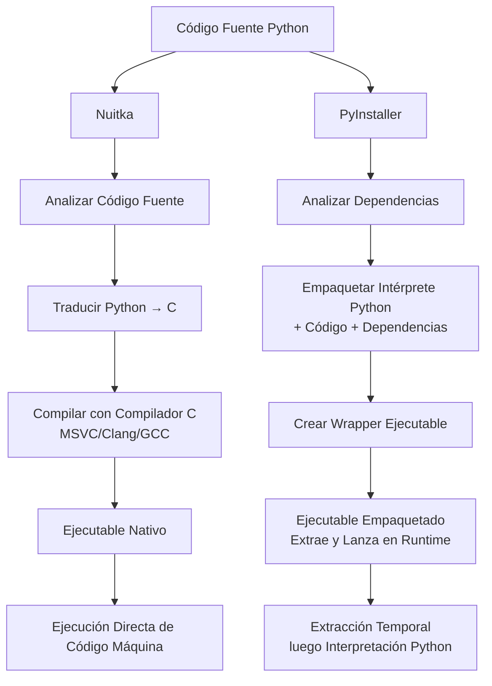

### Para Empezar....

Python fue diseñado como un **lenguaje interpretado** con estas suposiciones:

- **Visibilidad del código fuente**: Los archivos Python (.py) están destinados a ser texto legible
- **Flexibilidad en tiempo de ejecución**: Importaciones dinámicas, monkey patching y modificación de código en tiempo de ejecución
- **Modelo de distribución**: Compartir código fuente o instalar a través de gestores de paquetes (pip)
- **Flujo de trabajo de desarrollo**: Desarrollo interactivo con retroalimentación inmediata

<Info>
**Contexto Histórico**: Cuando Python fue creado en 1991, el concepto de "empaquetar un intérprete con tu código" no era una consideración primaria. El enfoque estaba en la simplicidad y legibilidad, no en la distribución independiente.
</Info>

Pero los usuarios querían una forma de redistribuir su código sin requerir que los usuarios finales instalaran Python o administraran dependencias. Esta necesidad impulsó la creación de herramientas como PyInstaller y Nuitka, cada una tomando enfoques fundamentalmente diferentes para resolver el mismo problema.

## Cómo Funcionan

### Congelación vs Compilación

PyInstaller no es un compilador, sino un *congelador*. Esencialmente toma el intérprete de Python, todas las dependencias, y las empaqueta juntas (piensa en .zip), luego crea un archivo ejecutable que extrae y ejecuta este paquete en tiempo de ejecución.

Nuitka realmente *transpilará* (convertir tanto código Python como sea posible de Python a C[1](#footnote-1)), luego *compilará* el código usando un compilador C como MSVC, Clang o GCC para producir código máquina nativo.

<AccordionGroup>
  <Accordion title="Por Qué el Software Antivirus Se Vuelve Sospechoso" icon="shield-exclamation">
    Tanto Nuitka como PyInstaller enfrentan un desafío común que se deriva de la filosofía de diseño fundamental de Python: **Python nunca fue diseñado para ser empaquetado en ejecutables independientes**.

    <Callout type="warning">
    **El Problema Central**: El software antivirus marca ambas herramientas porque exhiben comportamientos tradicionalmente asociados con malware - archivos autoextractores, carga dinámica de código y modificaciones en tiempo de ejecución.
    </Callout>

    Cuando empaquetas aplicaciones Python en ejecutables, varios factores activan las heurísticas antivirus:

    <Steps>
      <Step title="Comportamiento Autoextractor">
        Ambas herramientas crean ejecutables que desempaquetan intérpretes y librerías de Python en tiempo de ejecución, similar a como opera algún malware
      </Step>
      
      <Step title="Patrones de Importación Dinámica">
        El sistema `import` de Python carga código dinámicamente, lo que el software antivirus interpreta como inyección de código potencialmente maliciosa
      </Step>
      
      <Step title="Ejecución de Bytecode">
        Ejecutar bytecode de Python desde memoria (especialmente con PyInstaller) se asemeja a técnicas de malware sin archivos
      </Step>
      
      <Step title="Patrones de Ejecutable Poco Comunes">
        Los ejecutables resultantes tienen estructuras internas inusuales que no coinciden con binarios compilados típicos
      </Step>
    </Steps>
  </Accordion>

  <Accordion title="La Realidad de los Falsos Positivos" icon="triangle-exclamation">
    <Warning>
    **El Desafío Fundamental**: La naturaleza dinámica e interpretada de Python entra en conflicto con los patrones estáticos y predecibles que el software antivirus espera de ejecutables legítimos. Esta es la razón principal por la que ambas herramientas enfrentan problemas de detección - no es un bug, es un desajuste arquitectónico fundamental.
    </Warning>

    <Warning>
    **Experiencia Común**: Los motores antivirus frecuentemente marcan ejecutables Python recién compilados como programas potencialmente no deseados (PUP) o falsos positivos, independientemente de qué herramienta uses.
    </Warning>

    Este problema se ve agravado por una realidad dura: **ambas herramientas han sido ampliamente utilizadas por autores de malware**.

    <Callout type="error">
    **Abuso de Malware**: Nuitka y PyInstaller son opciones populares para distribución de malware porque hacen que el código malicioso basado en Python sea más difícil de analizar y detectar. Este uso legítimo por actores maliciosos ha entrenado a los sistemas antivirus para ser más sospechosos de ejecutables creados por estas herramientas.
    </Callout>

    Los desafíos de detección se derivan de múltiples factores:

    1. **Modelos de machine learning** en software AV están entrenados principalmente en lenguajes compilados tradicionales
    2. **Análisis comportamental** ve la naturaleza dinámica de Python como anómala
    3. **Sistemas de reputación** no han visto estos patrones específicos de ejecutables antes
    4. **Reglas heurísticas** están optimizadas para detectar malware tradicional, no intérpretes empaquetados
    5. **Asociación con malware**: Los motores AV han encontrado numerosas muestras maliciosas empaquetadas con estas herramientas

    **Nuitka enfrenta escrutinio particular** porque:
    - Su proceso de compilación puede ofuscar código Python malicioso más efectivamente que PyInstaller
    - Los ejecutables nativos resultantes son más difíciles de hacer ingeniería inversa para investigadores de seguridad
    - Los autores de malware lo prefieren para crear payloads más sigilosos
    - Los proveedores de AV han construido patrones de detección específicos alrededor de malware compilado con Nuitka
  </Accordion>

  <Accordion title="Estrategias de Mitigación" icon="wrench">
    Ambas herramientas ofrecen enfoques para reducir falsos positivos:

    - **Certificados de firma de código** ayudan a establecer confianza
    - **Envío gradual a AV** a proveedores principales para lista blanca
    - **Alternativas a UPX** o evitar compresión completamente
    - **Empaquetado mínimo** para reducir patrones comportamentales sospechosos
    - **Patrones amigables al análisis estático** en tu código Python
  </Accordion>
</AccordionGroup>

## Consideraciones de Rendimiento

<Info>
**Importante**: Aunque la compilación puede mejorar el rendimiento, no transformará mágicamente tu código Python en rendimiento de "velocidad C". Entender las expectativas realistas es crucial.
</Info>

### Lo Que la Compilación de Nuitka Realmente Proporciona

La compilación de Nuitka a C puede ofrecer mejoras de rendimiento en varias áreas:

- **Tiempo de inicio**: Los ejecutables nativos típicamente inician más rápido que extraer y lanzar un intérprete empaquetado
- **Sobrecarga de llamadas a funciones**: Las llamadas a funciones compiladas tienen menos sobrecarga que el bytecode interpretado
- **Optimizaciones de inferencia de tipos**: Nuitka puede optimizar ciertas operaciones cuando puede determinar tipos en tiempo de compilación
- **Rendimiento de bucles**: Los bucles simples con patrones predecibles pueden ver mejoras

### Conceptos Erróneos Comunes

<Warning>
**Mito**: "Compilar Python con Nuitka lo hace tan rápido como código C escrito a mano"

**Realidad**: Tu código Python todavía sigue la semántica de Python. La tipificación dinámica, la sobrecarga de creación de objetos y el modelo de memoria de Python permanecen. Espera mejoras modestas, no aceleraciones de órdenes de magnitud.
</Warning>

Las ganancias de rendimiento dependen mucho de tus patrones de código:

- **Operaciones numéricas intensivas en CPU**: Pueden ver mejoras significativas a través de optimizaciones en tiempo de compilación
- **Operaciones limitadas por I/O**: Poca o ninguna mejora (todavía limitado por I/O)
- **Uso intensivo de objetos Python**: Mejora mínima (la sobrecarga de objetos permanece)
- **Llamadas a librerías**: Sin mejora (NumPy, Pandas, etc. ya son código C optimizado)

### Perfil de Rendimiento de PyInstaller

PyInstaller no compila tu código, por lo que el rendimiento en tiempo de ejecución es idéntico a ejecutar con un intérprete Python estándar. Las únicas diferencias de rendimiento son:

- **Inicio más lento**: Debe extraer archivos empaquetados antes de la ejecución
- **Uso temporal del disco**: La extracción requiere espacio en disco y I/O
- **Sobrecarga de escaneo antivirus**: Los ejecutables empaquetados pueden activar escaneo más agresivo

## Expectativas de Tiempo de Compilación

<Warning>
**Diferencia Crítica**: La compilación de Nuitka puede tomar 10-100x más tiempo que el empaquetado de PyInstaller. Esto no es un bug - es la diferencia fundamental entre empaquetar y compilar.
</Warning>

### ¿Por Qué la Diferencia en Tiempo de Compilación?

**PyInstaller**:
- Analiza dependencias
- Copia archivos
- Crea archivo
- Envuelve en ejecutable

**Nuitka**:
- Analiza toda la base de código Python
- Traduce a C
- Genera miles de archivos C
- Invoca compilador C (MSVC/GCC/Clang)
- Une todo

### Factores del Tiempo de Compilación

Tu tiempo de compilación de Nuitka depende de:
- **Tamaño del proyecto**: Más código Python = más código C para generar y compilar
- **Dependencias**: Cada módulo importado agrega tiempo de compilación
- **Compilador C**: MSVC es más lento que GCC/Clang
- **Hardware**: Los núcleos de CPU y RAM impactan significativamente la compilación
- **Nivel de optimización**: `--lto=yes` habilita Link Time Optimization (LTO), donde el compilador puede optimizar a través de todas las unidades compiladas juntas en lugar de individualmente. Esto permite mejor inlining, eliminación de código muerto y optimizaciones entre módulos, mejorando el rendimiento pero aumentando significativamente el tiempo de compilación ya que todo el programa debe ser analizado como un todo

## La Conclusión

Ambas herramientas son excelentes en lo que hacen:

Como contribuidor de Nuitka, obviamente estoy sesgado, pero trato de ser objetivo: el enfoque de compilación de Nuitka puede proporcionar ventajas significativas. Dado que Nuitka transforma código Python en C nativo, ofrece excelente protección de código fuente IP, haciendo que tu código Python original sea mucho más difícil de hacer ingeniería inversa comparado con el enfoque de empaquetado de PyInstaller. Además, puedes ver mejoras modestas de rendimiento, particularmente para código limitado por CPU con patrones predecibles.

---

1 Técnicamente, Nuitka genera código C11 cuando es posible, recurriendo a C++ donde C11 no está disponible. Se restringe al subconjunto común de C11 y C++ para máxima portabilidad a través de diferentes compiladores y plataformas.

